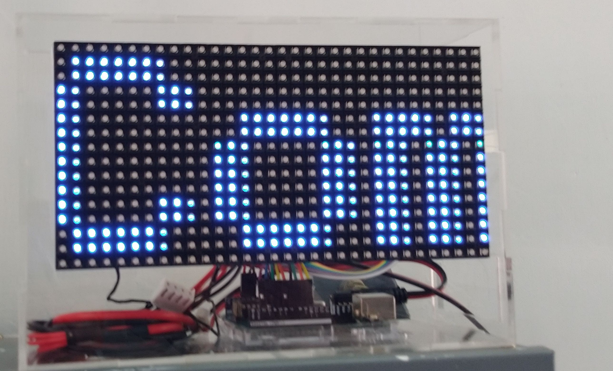
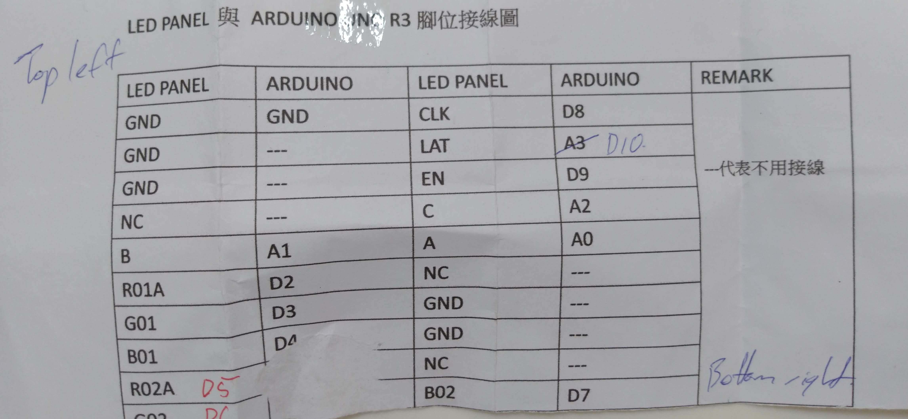

# arduino-led-matrix

Using an 16x32 LED matrix for a digital sign

Originally based on the example text scroller code provided by Adafruit. I've seen added a Wifi interface to it so the scroll text can be updated remotely.

## Hardware Requirements

* 16x32 LED matrix
* Arduino Uno
* ESP8266 Wifi module (I used a NodeMCU)

## Software Requirements

In your Arduino IDE / Manage Libraries, install the following:

* Adafruit GFX Library by Adafruit
* RGB maxtrix Panel by Adafruit

## Wiring

Looking at the rear of the matrix, 6there is a ribbon cable connector set of pins (2 columns of 9 pins). This was the wiring my matrix required:

## Protocol

* On power on, scroller will display `waiting...` until it receives data from the wifi module.
* When connecting to to a wifi network, scroller will display `Joining {ssid}`.
* Once connected to the network, scroller will diplay it's IP address.
* Connect to port 80 of the IP address. Send a string formatted as `message=This is an example message\n`.

## Future

I'm planning to migrate from the Arduino Mega + ESP8266 combination to just one ESP32 to power the lot. These references look like they'll come in handy...

https://www.instructables.com/RGB-LED-Matrix-With-an-ESP8266/
https://hackaday.io/project/28945/logs?sort=oldest
https://github.com/VGottselig/ESP32-RGB-Matrix-Display
